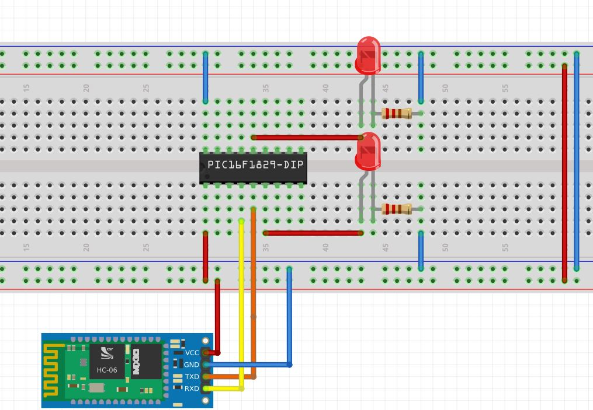

# PIC16f1829 Bluetooth Example

A basic example using the PIC16F1829 and HC-06 bluetooth module on the PICkit 3 Low Pin Count Demo Board

For a complete tutorial write-up, please see here: 

http://mcuhq.com/23/pic-microcontroller-bluetooth-example-with-an-android-phone

## Introduction

This is a project that shows how to send bidirectional data between an android phone and microcontroller. The 8-bit micro communicates with a bluetooth module via its UART pins. A terminal program on an android phone can then be used to send and receive data. 

## Required Tools

1. [PICkit 3 Low Pin Count Board](http://www.microchip.com/DevelopmentTools/ProductDetails.aspx?PartNO=dm164130-9&utm_source=&utm_medium=MicroSolutions&utm_term=&utm_content=DevTools&utm_campaign=PICkit+Low+Pin+Count+Demo+Board)
2. [HC-06 bluetooth module](https://www.olimex.com/Products/Components/RF/BLUETOOTH-SERIAL-HC-06/resources/hc06.pdf)
3. Android Phone with [Blueterm](https://play.google.com/store/apps/details?id=at.fusionimage.blueterm2) installed 
4. A few breadboard wires to connect the HC-06 to the PIC
5. Microchip [MPLABX](https://www.microchip.com/mplab/mplab-x-ide) and XC8 compiler

## Setup

1. Clone this repo and open it inside of MPLABx.
2. Compile 
3. Connect the HC-06 to the board
4. Install Blueterm for Android
5. Program the microcontroller 
5. Run the application on your phone after it installs. Connect to the HC-06 and you should see a number incrementing on the application every second. 

## Issues

Please submit all issues to the github tracker. Pull requests are also encouraged. General comments can be left either inside github or at [mcuhq.com](http://mcuhq.com/23/pic-microcontroller-bluetooth-example-with-an-android-phone).

